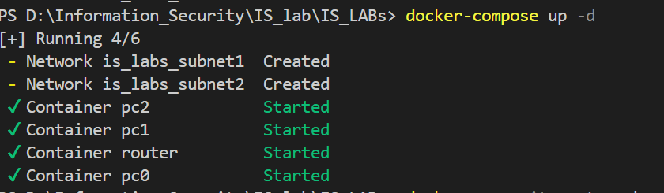
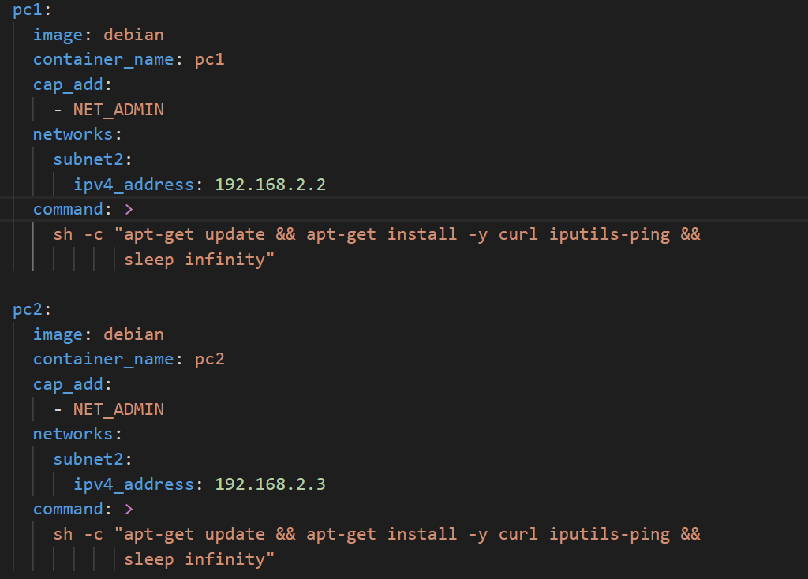
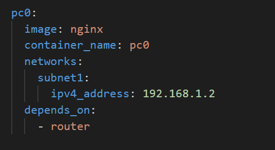
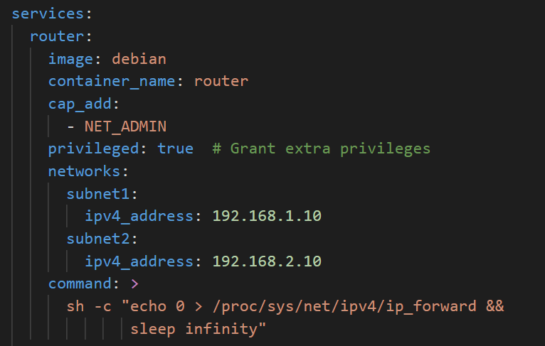
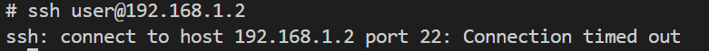
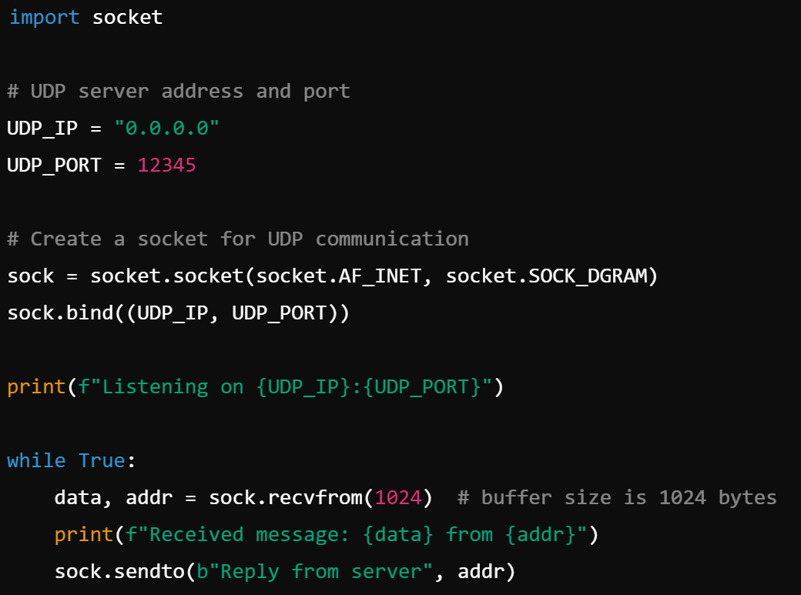
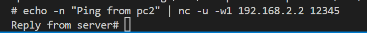
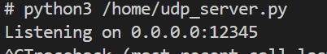
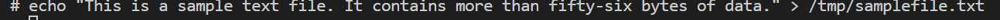

# Lab #1,22110038, Phan Trieu Huy, INSE331280E_03FIE
# Task 1: Firewall configuration 
This lab explores various encryption algorithm with openssl
**Question 1**: 
Setup a set of vms/containers in a network configuration of 2 subnets (1,2) with a router forwarding traffic between them. Relevant services are also required:
- The router is initially can not route traffic between subnets
- PC0 on subnet 1 serves as a web server on subnet 1
- PC1,PC2 on subnet 2 acts as client workstations on subnet 2 
**Answer 1**:

## 1. Create docker VMs:
### 1.1 build docker:
I have created file docker with: pc0 on subnet1 and pc1,pc2 on subnet2, and router:

### 1.2 Setup in file docker:

- with pc1, pc2 on subnet:
192.168.2.0/24

- and pc0 on subnet:
192.168.1.0/24

- and router:

The command 'echo 0 > /proc/sys/net/ipv4/ip_forward' ensures that IP forwarding is disabled

**Question 2**:
- Enable packet forwarding on the router.
- Deface the webserver's home page with ssh connection on PC1

**Answer 2**:

## 1. Enable Packet Forwarding: 
To enable packet forwarding, run this :
'echo 1 > /proc/sys/net/ipv4/ip_forward'

after run, i can check by comand line:
cat /proc/sys/net/ipv4/ip_forward

## 2. Deface the webserver's home page with ssh connection on PC1: 

- install ssh:
apt-get update
apt-get install -y openssh-client

- access the pc0:
curl http://192.168.1.2

- Install nano:
apt-get update
apt-get install -y nano iputils-ping net-tools
- edit file index.html:
nano /usr/share/nginx/html/index.html

- test: 
curl http://192.168.1.2

**Question 3**:
  Config the router to block ssh to web server from PC1, leaving ssh/web access normally for all other hosts from subnet 1.   
**Answer 3**:
- in router:
block  pc1: 

iptables -A FORWARD -s 192.168.2.2 -d 192.168.1.2 -p tcp --dport 22 -j REJECT

and allow all traffic from subnet1:

iptables -A FORWARD -s 192.168.2.0/24 -d 192.168.1.0/24 -j ACCEPT

- after run block pc1 i will test:

ssh user@192.168.1.2

ssh on pc2:

**Question 4**:
- PC1 now servers as a UDP server, make sure that it can reply UDP ping from other hosts on both subnets.
- Config personal firewall on PC1 to block UDP accesses from PC2 while leaving UDP access from the server intact.
**Answer 4**:
## 1. Create UDP server on PC1:

- on pc1, install python :
    apt-get update
    apt-get install -y python3
- and create:
nano /home/udp_server.py
with content is: 

it will listening on 0.0.0.0:12345 

now check when ping:

## 2. Block PC2:
using this comandline:

iptables -A INPUT -s 192.168.2.3 -p udp --dport 12345 -j DROP

now pc2 cant ping to pc1:

# Task 2. Encrypting large message

create samplefile.txt

**Question 1**:
Encrypt the file with aes-cipher in CTR and OFB modes. How do you evaluate both cipher in terms of error propagation and adjacent plaintext blocks are concerned. 
**Answer 1**:

- install xxd:
apt-get install xxd
-  generate key:
openssl enc -aes-128-ctr -in /tmp/samplefile.txt -out /tmp/encrypted_ctr.bin -K $(openssl rand -hex 16) -iv $(openssl rand -hex 16)

- and on pc0: 
nc -l -u -p 12345 > /tmp/encrypted_from_pc2.bin
nc -l -u -p 12346 > /tmp/hmac_from_pc2.txt

- on pc2:
nc -u 192.168.1.2 12345 < /tmp/encrypted_ctr.bin
nc -u 192.168.1.2 12346 < /tmp/hmac_ctr.txt
